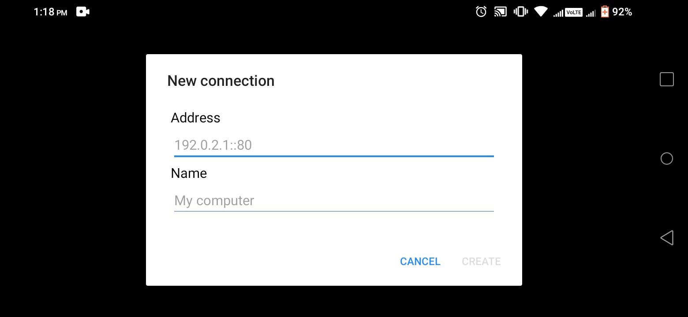

# How to Install WireShark in Termux?

  
  
  
  

  
  <!--</a>-->

## [+] About Wireshark
<i>

**What Is Wireshark Used For?**

Wireshark has many uses, including troubleshooting networks that have performance issues. Cybersecurity professionals often use Wireshark to trace connections, view the contents of suspect network transactions and identify bursts of network traffic. It’s a major part of any IT pro’s toolkit – and hopefully, the IT pro has the knowledge to use it.

**When Should Wireshark Be Used?**

Wireshark is a safe tool used by government agencies, educational institutions, corporations, small businesses and nonprofits alike to troubleshoot network issues. Additionally, Wireshark can be used as a learning tool.

Those new to information security can use Wireshark as a tool to understand network traffic analysis, how communication takes place when particular protocols are involved and where it goes wrong when certain issues occur.

Of course, Wireshark can’t do everything.

First of all, it can’t help a user who has little understanding of network protocols. No tool, no matter how cool, replaces knowledge very well. In other words, to properly use Wireshark, you need to learn exactly how a network operates. That means, you need to understand things such as the three-way TCP handshake and various protocols, including TCP, UDP, DHCP and ICMP.

Second, Wireshark can’t grab traffic from all of the other systems on the network under normal circumstances. On modern networks that use devices called switches, Wireshark (or any other standard packet-capturing tool) can only sniff traffic between your local computer and the remote system it is talking to.

Third, while Wireshark can show malformed packets and apply color coding, it doesn’t have actual alerts; Wireshark isn’t an intrusion detection system (IDS).

Fourth, Wireshark can’t help with decryption with regards to encrypted traffic.

And finally, it is quite easy to spoof  IPv4 packets. Wireshark can’t really tell you if a particular IP address it finds in a captured packet is a real one or not. That requires a bit more know-how on the part of an IT pro, as well as additional software.

</i>
 

## [+] At First Download Termux from F-Droid and Install it
- Link -?> <a href="https://f-droid.org/en/packages/com.termux/" target="_blank">**Here**</a>

## [+] Setup Process
- ` termux-setup-storage `
- ` apt update `
- ` apt upgrade -y `

> Then keep all default [N]

- ` pkg install x11-repo `

- ` apt install xterm tigervnc tigervnc-viewer `

- ` apt install wireshark-gtk `

- ` vncserver `
> Now set Password of 6 characters and then,

- ` vncserver -list `
> You can check all active servers

- ` wireshark `
> This will run your Wireshark on VNC Server

> Then open a new session in terminal and run these commands to check out
- ` ifconfig `
> From here you have to find the local ip

- ` nmap local_ip `
> From here check the TCP port that being used by VNC Server. It might be 5901

> Then Install the given VNC Viwer from Playstore. You can also download from here: <a href="https://github.com/InferiorAK/wireshark-installation-termux/raw/main/VNC%20Viewer_4.1.0.49169.apk">**Here**</a>
 

> Then Install and Run it like me
  

**Now Enjoy!**
  
## [+] Contact :

 

 

